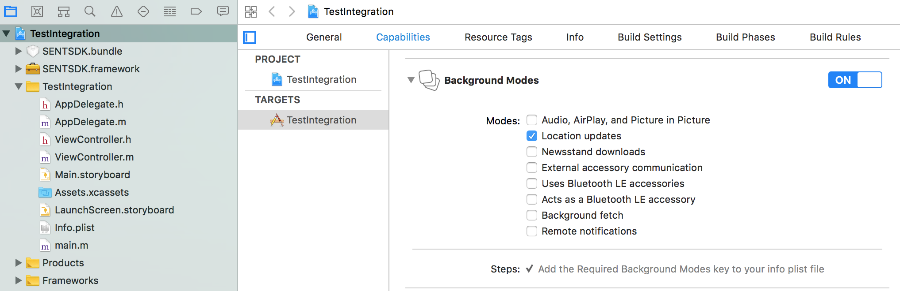

# react-native-sentiance

## Demo Application

https://github.com/sentiance/react-native-sentiance-example

## Getting started

`$ npm install react-native-sentiance --save`

### Manual installation

#### iOS

**with Cocoapods**

1. Add `RNSentiance` Pod to your Podfile
   ```
   pod 'RNSentiance', :path => '../node_modules/react-native-sentiance/ios/RNSentiance.podspec'
   ```
2. Add `SENTSDK` Pod to your Podfile
   ```
   pod 'SENTSDK', :podspec => '../node_modules/react-native-sentiance/ios/SENTSDK.podspec'
   ```
3. Run `pod install` in your `ios` folder

**without Cocoapods**

1. [Download](https://developers.sentiance.com/docs/sdk/ios/integration) the latest version of the Sentiance iOS SDK from our developer documentation.
2. In XCode, in the project navigator, right click `Libraries` ➜ `Add Files to [your project's name]`
3. Go to `node_modules` ➜ `react-native-sentiance-library` and add `RNSentianceLibrary.xcodeproj`
4. In XCode, in the project navigator, select `RNSentianceLibrary.xcodeproj`. Add the folder where `SENTSDK.framework` is located to `Search Paths` ➜ `Framework Search Paths`
5. In XCode, in the project navigator, select your project. Add `libRNSentianceLibrary.a` to your project's `Build Phases` ➜ `Link Binary With Libraries`
6. Run your project (`Cmd+R`)<

**Configuring capabilities**

1. Go to the **Capabilities** tab of your target settings
1. Turn on **Background Modes** and enable **Location updates**
1. Turn off **Data protection**



#### Native initialization

In your `AppDelegate` add the following:

```objective-c
  #import <React/RCTBundleURLProvider.h>
  #import <React/RCTRootView.h>
  @import SENTSDK;
  #import <RNSentiance.h>

- (BOOL)application:(UIApplication *)application didFinishLaunchingWithOptions:(NSDictionary *)launchOptions
{
  RCTBridge *bridge = [[RCTBridge alloc] initWithDelegate:self launchOptions:launchOptions];
  RCTRootView *rootView = [[RCTRootView alloc] initWithBridge:bridge
                                                   moduleName:@"RNSentiance"
                                            initialProperties:nil];

  // Read SENTIANCE_APP_ID and SENTIANCE_APP_SECRET from any safe source
  NSString * SENTIANCE_APP_ID = @"";
  NSString * SENTIANCE_APP_SECRET = @"";

  [[bridge moduleForName:@"RNSentiance"] initSDK:SENTIANCE_APP_ID secret:SENTIANCE_APP_SECRET baseURL:nil shouldStart:YES resolver:nil rejecter:nil];

  .....

  return YES;
}
```

#### Android

1. Open up youd application class`android/app/src/main/java/[...]/{your-app-class}.java`

- Add `import com.reactlibrary.RNSentiancePackage;` to the imports at the top of the file
- Add `new RNSentiancePackage()` to the list returned by the `getPackages()` method

2. Append the following lines to `android/settings.gradle`:
   ```
   include ':react-native-sentiance'
   project(':react-native-sentiance').projectDir = new File(rootProject.projectDir, 	'../node_modules/react-native-sentiance/android')
   ```
3. Insert the following lines inside the dependencies block in `android/app/build.gradle`:
   ```
   compile project(':react-native-sentiance')
   ```
4. Add following entry to `android/build.gradle`
   ```
   allprojects {
     repositories {
       ...
       maven {
           url "http://repository.sentiance.com"
       }
     }
   }
   ```
5. Configure foreground notification, Add the following lines to application's `AndroidManifest.xml` file inside `<application>` tag:
   ```xml
   <meta-data android:name="com.sentiance.react.bridge.notification_title" android:resource="@string/app_name"/>
   <meta-data android:name="com.sentiance.react.bridge.notification_text" android:value="Touch to open."/>
   <meta-data android:name="com.sentiance.react.bridge.notification_icon" android:resource="@mipmap/ic_launcher"/>
   <meta-data android:name="com.sentiance.react.bridge.notification_channel_name" android:value="Sentiance"/>
   <meta-data android:name="com.sentiance.react.bridge.notification_channel_id" android:value="sentiance"/>
   ```

#### Manifest permissions

If you're targeting API level 29 and above, you must add the following permissions to your application's `AndroidManifest.xml` file, inside the `<manifest>` tag:

```xml
  <uses-permission android:name="android.permission.ACCESS_BACKGROUND_LOCATION"/>
  <uses-permission android:name="android.permission.ACTIVITY_RECOGNITION"/>
```
For more information about why these permissions are required, please refer to our [Android Permissions](https://docs.sentiance.com/sdk/getting-started/android-sdk/permissions) page.

#### Native initialization

Inside `Application#onCreate()` method, initialize and start sentiance SDK

```java
@Override
public void onCreate() {
  super.onCreate();
  SoLoader.init(this, /* native exopackage */ false);
  RNSentianceHelper rnSentianceHelper = RNSentianceHelper.getInstance(getApplicationContext());
      rnSentianceHelper.initializeSentianceSDK(
              SENTIANCE_APP_ID,SENTIANCE_SECRET, // app id and secret
              true, //auto start
              null, // init callback
              null // start callback
      );
      ...
}
```

_NOTE: Ideally, initializing the SDK is done from `AppDelegate's didFinishLaunchingWithOptions` or `Application's onCreate` method as this will guarantee that the SDK is running as often as possible. If your application uses a login flow, you will want to start the SDK only if the user is logged in, at that point you could start the SDK through JavaScript. Once the user is logged in, the SDK should always start before the end of `onCreate or didFinishLaunchingWithOptions`. Please refer to https://docs.sentiance.com/ for documentation on the SDK integration._

## Usage

```javascript
import RNSentiance from "react-native-sentiance";
```

#### Initialize and start the Sentiance SDK

Initialize and start sentiance SDK.

```javascript
try {
  const startResponse = await RNSentiance.init(
    APP_ID,
    APP_SECRET, // app id and secret
    null, // override base url
    true // auto start
  );
} catch (err) {
  // SDK did not start.
}
```

#### Starting the Sentiance SDK

If SDK is not started automatically i.e `shouldStart = false` during init, it can be started manually.

```javascript
try {
  const startResponse = await RNSentiance.start();
  const { startStatus } = startResponse;
  if (startStatus === "STARTED") {
    // SDK started properly.
  } else if (startStatus === "PENDING") {
    // Something prevented the SDK to start properly. Once fixed, the SDK will start automatically.
  }
} catch (err) {
  // SDK did not start.
}
```

Start SDK with stop date.

```javascript
try {
  const startResponse = await RNSentiance.startWithStopDate(stopEpochTimeMs);
} catch (err) {
  // SDK did not start.
}
```

#### Stopping the Sentiance SDK

Stopping is only allowed after successful initialization. While it's possible to "pause" the detections modules of the Sentiance SDK's, it's not recommended.

```javascript
try {
  const stopResponse = await RNSentiance.stop();
  // SDK stopped properly.
} catch (err) {
  // An error prevented the SDK from stopping correctly
}
```

#### Init status

Checking if SDK is initialized

```javascript
const initState = await RNSentiance.getInitState();
const isInitialized = initState == "INITIALIZED";
```

#### SDK status

The status of the Sentiance SDK

```javascript
const sdkStatus = await RNSentiance.getSdkStatus();
```

The SDK can signal SDK status updates to JavaScript without being invoked directly. You can subscribe to these status updates by creating a new NativeEventEmitter instance around your module, and adding a listener for `SDKStatusUpdate`.

```javascript
import { NativeEventEmitter } from "react-native";

const sentianceEmitter = new NativeEventEmitter(RNSentiance);
const subscription = sentianceEmitter.addListener("SDKStatusUpdate", res => {
  // Returns SDK status
});

// Don't forget to unsubscribe, typically in componentWillUnmount
subscription.remove();
```

#### Get SDK version

```javascript
const version = await RNSentiance.getVersion();
```

#### Get user id

If the SDK is initialized, you can get the user id as follows. This user id will allow you to interact with the API's from Sentiance. You need a token and user to authorize requests and query the right data.

```javascript
const userId = await RNSentiance.getUserId();
```

#### Get user access token

If the SDK is initialized, you can get a user access token as follows. This token will allow you to interact with the API's from Sentiance. You need a token and user to authorize requests and query the right data. If the token has expired, or will expire soon, the SDK will get a new bearer token before passing it to the callback. Generally, this operation will complete instantly by returning a cached bearer token, but if a new token has to be obtained from the Sentiance API, there is a possibility it will fail.

```javascript
const { tokenId } = await RNSentiance.getUserAccessToken();
```

#### Adding custom metadata

Custom metadata allows you to store text-based key-value user properties into the Sentiance platform.
Examples are custom user id's, application related properties you need after the processing, ...

```javascript
const label = "correlation_id";
const value = "3a5276ec-b2b2-4636-b893-eb9a9f014938";

await RNSentiance.addUserMetadataField(label, value);
```

#### Remove custom metadata

You can remove previously added metadata fields by passing the metadata label to the removeUserMetadataField function.

```javascript
const label = "correlation_id";

await RNSentiance.removeUserMetadataField(label);
```

#### Adding multiple custom metadata fields

You can add multiple custom metadata fields by passing an object to the addUserMetadataFields function.

```javascript
const metadata = { corrolation_id: "3a5276ec-b2b2-4636-b893-eb9a9f014938" };

await RNSentiance.addUserMetadataFields(metadata);
```

#### Starting trip

Whenever you call startTrip on the SDK, you override moving state detection and the SDK will track the trip until you call stopTrip or until the timeout (2 hours) is reached. `startTrip` accepts a metadata object and a transport mode hint (`number`) as parameters.

Transport mode hint:

```
SENTTransportModeUnknown = 1,
SENTTransportModeCar = 2,
SENTTransportModeBicycle = 3,
SENTTransportModeOnFoot = 4,
SENTTransportModeTrain = 5,
SENTTransportModeTram = 6,
SENTTransportModeBus = 7,
SENTTransportModePlane = 8,
SENTTransportModeBoat = 9,
SENTTransportModeMetro = 10,
SENTTransportModeRunning = 11
```

Example:

```javascript
const metadata = { corrolation_id: "3a5276ec-b2b2-4636-b893-eb9a9f014938" };
const transportModeHint = 1;

try {
  await RNSentiance.startTrip(metadata, transportModeHint);
  // Trip is started
} catch (err) {
  // Unable to start trip
}
```

#### Stopping trip

```javascript
try {
  const trip = await RNSentiance.stopTrip();
  // Stopped trip
} catch (err) {
  // Unable to stop trip
}
```

The SDK can also signal trip timeouts to JavaScript. You can subscribe to these trip timeouts by creating a new NativeEventEmitter instance around your module, and adding a listener for `TripTimeout`.

```javascript
import { NativeEventEmitter } from "react-native";

const sentianceEmitter = new NativeEventEmitter(RNSentianceLibrary);
const subscription = sentianceEmitter.addListener("TripTimeout", () => {
  // Trip timeout received
});
```

#### Trip status

Checking trip status

```javascript
const isTripOngoing = await RNSentiance.isTripOngoing();
```

#### Control sending data

If you want to override the default behavior, you can initiate a force submission of detections. Ideally, you use this method only after explaining to the user that your app will consume more bandwidth in case the device is not connected to Wi-Fi.

```javascript
try {
  await RNSentiance.submitDetections();
} catch (err) {
  // Something went wrong with submitting data, for more information, see the error variable
}
```

#### Disk, mobile network and Wi-Fi quotas

The actual usages and limits in bytes can be obtained using the getWiFiQuotaUsage, getWiFiQuotaLimit and similar methods on the Sentiance SDK interface.

```javascript
const limit = await RNSentiance.getWiFiQuotaLimit();
```

All quota functions:

- `getWiFiQuotaLimit`
- `getWiFiQuotaUsage`
- `getMobileQuotaLimit`
- `getMobileQuotaUsage`
- `getDiskQuotaLimit`
- `getDiskQuotaUsage`

#### User Activity

Get user current activity

```javascript
const userActivity = await RNSentiance.getUserActivity();
```

The SDK can signal user activity updates to JavaScript without being invoked directly. You can subscribe to these user activity updates by creating a new NativeEventEmitter instance around your module, and adding a listener for `SDKUserActivityUpdate`.

```javascript
import { NativeEventEmitter } from "react-native";

const sentianceEmitter = new NativeEventEmitter(RNSentiance);
const subscription = sentianceEmitter.addListener(
  "SDKUserActivityUpdate",
  userActivity => {
    // Handle user activity
  }
);

RNSentiance.listenUserActivityUpdates();

// Don't forget to unsubscribe, typically in componentWillUnmount
subscription.remove();
```

Handling user activity

```javascript
const { type, tripInfo, stationaryInfo } = userActivity;

if (type === "USER_ACTIVITY_TYPE_STATIONARY") {
  const { location } = stationaryInfo;

  if (location) {
    const { latitude, longitude } = location;
  }
  //..
} else if (type === "USER_ACTIVITY_TYPE_TRIP") {
  //..
} else if (type === "USER_ACTIVITY_TYPE_UNKNOWN") {
  //..
}
```

#### Update SDK foreground notification (ANDROID ONLY)

Updates the title and text of SDK notification. After calling this method, any notification shown by the SDK will be updated.

Note that this change is valid only during the process's lifetime. After the app process restarts, the SDK will display the default notification.

```javascript
/**
 * {string} title
 * {string} message
 */
await RNSentiance.updateSdkNotification("RN SDK Sample", "SDK is running");
```

#### User linking

To make use of this feature, you must initialize the SDK by calling `RNSentiance.initWithUserLinkingEnabled` instead of `RNSentiance.init`.

During initialization, the SDK will send a `SDKUserLink` event along with an `installId`. This install ID should be linked to your third party ID. After successful linking, you must call `RNSentiance.userLinkCallback(true)` to notify the SDK. If linking fails, you must instead call `RNSentiance.userLinkCallback(false)`.

_Please refer to https://docs.sentiance.com/guide/user-linking for documentation on the user linking._

```javascript
import { NativeEventEmitter } from "react-native";

const sentianceEmitter = new NativeEventEmitter(RNSentiance);
sentianceEmitter = rnSentianceEmitter.addListener("SDKUserLink", id => {
  const { installId } = id;

  //send this installid to you server for linking
  linkUser(installId);

  //once linking is done notify sdk
  RNSentiance.userLinkCallback(true);
});
```

_NOTE: `SDKUserLink` listener must be set before calling `RNSentiance.initWithUserLinkingEnabled`._

#### Resetting the SDK

To delete the Sentiance user and its data from the device, you can reset the SDK by calling `RNSentiance.reset`. This allows you to create a new Sentiance user by reinitializing the SDK, and link it to a new third party ID.

```javascript
try {
  await RNSentiance.reset();
  // The SDK was succesfully reset
} catch (err) {
  // Resetting the SDK failed
  // err.name has three values: SDK_INIT_IN_PROGRESS, SDK_RESET_IN_PROGRESS, SDK_RESET_UNKNOWN_ERROR
}
```

#### Crash Event Detection

Subscribe to vehicle crash events.

```javascript
import { NativeEventEmitter } from "react-native";

const sentianceEmitter = new NativeEventEmitter(RNSentiance);
const sdkCrashEventSubscription = sentianceEmitter.addListener(
  "SDKCrashEvent",
  ({ time, lastKnownLocation }) => {
    // parameter time is in milliseconds
    // parameter lastKnownLocation is nullable
    if (lastKnownLocation) {
      const { latitude, longitude } = lastKnownLocation;
    }
  }
);

RNSentiance.listenCrashEvents();

// To unsubscribe
sdkCrashEventSubscription.remove();
```

#### Trip Profiling

##### Handle on-device trip profiling

```javascript
import { NativeEventEmitter } from "react-native";

const sentianceEmitter = new NativeEventEmitter(RNSentiance);

const sdkTripProfilesSubscription = sentianceEmitter.addListener(
  "SDKTripProfile",
  /**
   * tripProfile: {
   *   tripId: String
   *   transportSegments: Array[
   *     TransportSegment{
   *       startTime: number // milliseconds since 1970-01-01
   *       endTime: number // milliseconds since 1970-01-01
   *       vehicleMode: string, VEHICLE | NOT_VEHICLE | IDLE | UNKNOWN
   *       distance?: number // in meters
   *       averageSpeed?: number // the average speed travelled in m/s
   *       topSpeed?: number // the top speed travelled in m/s
   *       percentOfTimeSpeeding?: number // the percent of time the user was speeding
   *       hardEvents?: Array[
   *         HardEvent{
   *           magnitude: number, the magnitude of this hard event in m/s2
   *           timestamp: milliseconds since 1970-01-01
   *         }
   *       ]
   *     }
   *   ]
   * }
   */
  (tripProfile) => {
  }
);
RNSentiance.listenTripProfiles();

// To unsubscribe
sdkTripProfilesSubscription.remove();
```

##### Update Trip profiling config

```javascript
/**
 * enableFullProfiling:
 *   If set to true, full trip profiling will be enabled allowing the Sentiance platform to profile
 *   the trip and the results made available via the API. In addition, the app will no longer receive trip profiles via
 *   the "SDKTripProfile" listener.
 *   If set to false, on-device trip profiling will be enabled.
 * speedLimit:
 *   Sets the speed limit in km/h, which is used to determine the percent of time the user was speeding.
 *   If null, the SDK will use an internal default value.
 */
try {
  await RNSentiance.updateTripProfileConfig({ enableFullProfiling: false, speedLimit: 80 })
} catch (err) {
  console.error(err)
}
```
