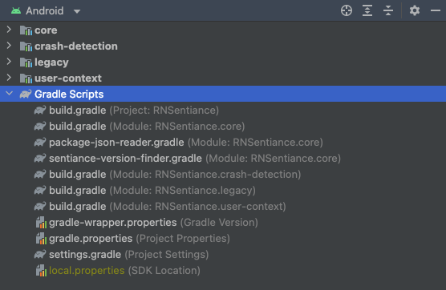
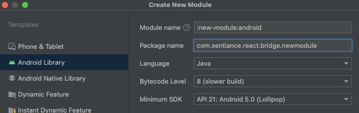
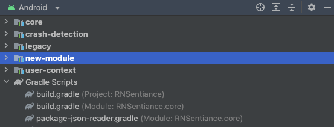

# Creating new SDK modules

## Initial setup

Start by creating a new directory with the name of the new module under the `packages` folder:

```bash
/packages/new-module
```

A typical SDK module has the following structure:

```
newModule
│   README.md
│   package.json
│
└───android <-- The module's native android code goes here
└───ios <-- The module's native iOS code goes here
└───lib <-- The module's Javascript code goes here
    │   index.js <-- The public interface that is exposed to the module's consumers
    │   index.d.ts <-- Typescript definitions for the public Javascript interface
```

Open up a terminal, navigate to the new module directory and run `npm init -y`:

```bash
cd new-module
npm init -y
```

This will create a new `package.json` file under the `new-module` directory.

A typical, minimalistic SDK module's `package.json` file looks like this:

```json
{
  "name": "@sentiance-react-native/new-module",
  "version": "0.0.1",
  "description": "New module description goes here",
  "main": "lib/index.js",
  "typings": "lib/index.d.ts",
  "scripts": {
    "test": "echo \"Error: no test specified\" && exit 1",
    "lint": "npx eslint lib/index.d.ts"
  },
  "keywords": [
    "react-native",
    "new-module",
    "sentiance"
  ],
  "peerDependencies": {
    "@sentiance-react-native/core": "6.0.0"
  },
  "homepage": "https://github.com/sentiance/react-native-sentiance/packages/new-module#readme",
  "repository": "github:sentiance/react-native-sentiance"
}
```

Overwrite the contents of the newly created `package.json` with the code above.

The key fields to note here are:

* **name**: the "fully qualified" name of the module. Notice the use of the Sentiance organisation name (`@sentiance-react-native/`)
* **version**: the version of the module.
* **description**: a human friendly description of the module to help people discover this module.
* **main**: the entry point of this module and our public Javascript interface.
* **typings**: specifies the main typescript declaration file for this module.
* **scripts**: every module has 2 npm scripts by default: `test` and `lint`. These scripts run on CircleCI during development and before publishing this module to NPM. For more information, check the related CircleCI workflows.


Create a new directory inside the new module folder and call it `lib`. This is where the JS code of your module will reside.

Inside the `lib` folder, create an `index.js` file. This will be the entry point of this new module.


## General configuration

### Edit the top level `package.json` file

Open up the `packages/package.json` file, and add a new NPM workspace for the new module:

```json
  "workspaces": [
    ...,
    "packages/new-module"
  ],
```

This guarantees that the new module gets picked up by the npm scripts that take care of publishing all SDK modules locally, and that CircleCI will also be able to pick up and publish the new module along with the others.

### Edit the `sync-package-versions.js` script

This script takes care of updating:

- All JS modules' versions
- The Sentiance peer dependencies' versions
- The native iOS modules' versions

to match a certain version.
It uses the configuration specified under `TARGET_MODULES` as input to know exactly the names of the JS modules + native iOS modules to change.

open up the script and edit the `TARGET_MODULES` array to include the new module as well: (Assuming the new module also has an `IosNewModule` module with a `IosNewModule.podspec` file)

```javascript
const TARGET_MODULES = [
  {
    name: 'new-module',
    iosModuleName: 'IosNewModule'
  },
  ...
];
```

To run this script, run the following command:

```bash
npm run sync:package_versions
```

**P.S**: this script uses special NPM environment variables to fetch the new version to be applied, and hence must run through `npm` instead of directly through `node`.

## Android configuration

Open up Android studio, and open the library's `packages` folder as a separate project. Once Gradle finishes building and indexing the project, you should be able to see the currently available Android modules for all of the existing Sentiance React Native SDKs:



Click the dropdown list on the top and switch from the _Android_ view to the _Project_ view. You should now be able to see the new-module directory that you created in a previous step:

.png)

Next, create a new Android module via the top level menu on AS: `File -> New -> New Module`:

1. Specify the module name to be `:new-module:android`. This will create an `android` directory inside the `new-module` folder, inside which the native Android code for this module will reside.
2. Set the package name to `com.sentiance.react.bridge.newmodule`. It is important to use the prefix `com.sentiance.react.bridge`, as it is the common top level namespace for all the Sentiance React Native SDKs.
3. Keep the other defaults, and click `Finish`.



Open up the top project's `settings.gradle` file. You should see in there a new line that was added to include `new-module` into this project's gradle builds. Remove it:

```groovy
// Some other code that was omitted for brevity

['core', 'crash-detection', 'user-context', 'legacy'].each { projectName ->
def module = ":$projectName"
  include(module)
  project(module).projectDir = new File(rootProject.projectDir, "./$projectName/android")
}
include ':new-module:android' // Remove this line
```

Then, add a 'new-module' entry to the existing array of SDK module names as follows:

```groovy
// Some other code that was omitted for brevity

['core', 'crash-detection', 'user-context', 'legacy', 'new-module'].each { projectName ->
def module = ":$projectName"
  include(module)
  project(module).projectDir = new File(rootProject.projectDir, "./$projectName/android")
}
```

This ensures that the new module will be picked up by Android Studio along the other modules when opening up the `packages` folder as a standalone AS project.


Open up the new module's `AndroidManifest.xml` file, and make sure to include the module package declaration:

```xml
<manifest package="com.sentiance.react.bridge.newmodule">
</manifest>
```

Re-sync Gradle, and now you should be able to see the new module under the `Android` view:



Open up the new module's `build.gradle` file, and replace its contents with the following code:

```groovy
plugins {
  id "com.android.library"
}

def coreProj
if (findProject(':core')) {
  coreProj = project(':core')
} else if (findProject(':sentiance-react-native_core')) {
  // Starting from RN 0.61, the @ sign is stripped from project names
  coreProj = project(':sentiance-react-native_core')
} else if (findProject(':@sentiance-react-native_core')) {
  // On RN 0.60, the @ sign is not stripped from project names
  coreProj = project(':@sentiance-react-native_core')
} else {
  throw new GradleException('Could not find the @sentiance-react-native/core package, have you installed it?')
}

android {
  compileOptions {
    sourceCompatibility JavaVersion.VERSION_1_8
    targetCompatibility JavaVersion.VERSION_1_8
  }
}

apply from: "$coreProj.projectDir/package-json-reader.gradle"
apply from: "$coreProj.projectDir/sentiance-version-finder.gradle"

def corePackageJson = PackageJson.of(coreProj)
applyAndroidVersionsFrom(corePackageJson)
def sentianceSdkVersion = getSentianceSdkVersion()

dependencies {
  api coreProj

  // Add here any other dependencies that the new module requires
}

applyReactNativeDependency()
```

- The `core` module provides essential functionality and hence, every other SDK module has a dependency on it.
  So we add some code in there to verify that the `core` module is installed and available.
- In order to specify this module's `minSdkVersion`, `targetSdkVersion`, `compileSdkVersion`, we add a call to `applyAndroidVersionsFrom(corePackageJson)`. This uses the values indicated on the `core` module's `package.json` file and applies them onto this module.

You are now ready to create a bridge module to expose functionality to Javascript code. Create a new class called `MyNewModule`:

```java
package com.sentiance.react.bridge.newmodule;

import androidx.annotation.NonNull;

import com.facebook.react.bridge.ReactApplicationContext;
import com.facebook.react.bridge.ReactMethod;
import com.sentiance.react.bridge.core.base.AbstractSentianceModule;

public class MyNewModule extends AbstractSentianceModule {

  // This is the name that Javascript code will use to refer to this native module
  private static final String NATIVE_MODULE_NAME = "MyNewModule";

  public MyNewModule(ReactApplicationContext reactApplicationContext) {
    super(reactApplicationContext);
  }

  @NonNull
  @Override
  public String getName() {
    return NATIVE_MODULE_NAME;
  }

  @ReactMethod
  public void addListener(String eventName) {
    // Set up any upstream listeners or background tasks as necessary
  }

  @ReactMethod
  public void removeListeners(Integer count) {
    // Remove upstream listeners, stop unnecessary background tasks
  }
}
```

## iOS configuration

### Project
Use exisiting module as reference and update the following.

- Module name via Xcode.
- Podspec file.
- Classes name for: native module, converter, error codes.

### Native Module
In your native module class `NewModule.m` add these methods to prevent react-native runtime warnings.
```obj-c  
@property (assign) BOOL hasListeners;

// Will be called when this module's first listener is added.
- (void)startObserving {
    self.hasListeners = YES;
    // Set up any upstream listeners or background tasks as necessary
}

// Will be called when this module's last listener is removed, or on dealloc.
- (void)stopObserving {
    self.hasListeners = NO;
    // Remove upstream listeners, stop unnecessary background tasks
}
```

