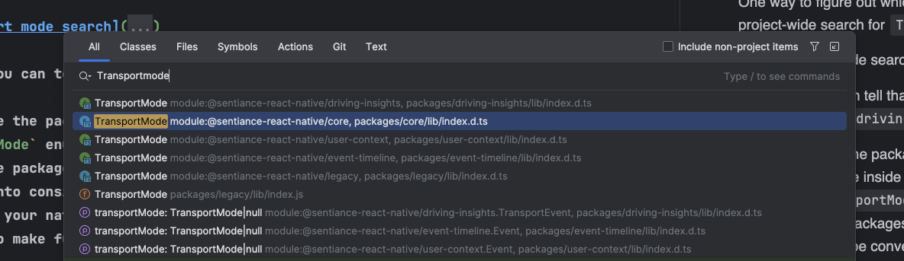

To add project-wide support for a new transport mode, follow these steps:

- Locate the `packages/driving-insights/lib/avg-overall-safety-score-api.js` and add the new transportMode to the `VALID_TRANSPORT_MODES` constant defined there.
- You need to update all the Typescript code that references transport modes. One way to figure out which packages you need to look into is
by doing a project-wide search for `TransportMode`:

And from there you can tell that this is being used in the `core`, `event-timeline`, `user-context` and `driving-insights` packages.

- Once you locate the packages in question, look for the `lib/index.d.ts` definitions files inside each package, then add the new transport mode to the 
`TransportMode` enum/union type.
- Try to rebuild your native code, and you should get compilation errors in all affected packages. Then your IDE will help you locate the Java/Objective-C files 
where you need to make further changes.
